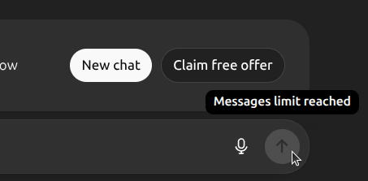
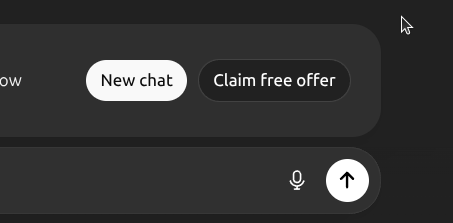

- [Enable Submit Button - Chrome/Brave Extension](#enable-submit-button---chromebrave-extension)
  - [✨ Features](#-features)
  - [Screenshots](#screenshots)
  - [🚀 Installation](#-installation)
    - [From Source (Developer Mode)](#from-source-developer-mode)
  - [From Release (Manual Download)](#from-release-manual-download)

# Enable Submit Button - Chrome/Brave Extension

A lightweight browser extension that automatically enables the submit button on ChatGPT when it's disabled. Features a simple toggle to turn the auto-enable feature on/off.

## ✨ Features

- 🔄 Auto-enable - Automatically enables disabled submit buttons
- 💾 Persistent Settings - Remembers your preference across sessions
- 🎯 ChatGPT Only - Only activates on ChatGPT domains
- ⚡ Lightweight - Minimal code, no bloat

## Screenshots

|                  Before                  |                  After                  |
| :--------------------------------------: | :-------------------------------------: |
|  |  |

## 🚀 Installation

### From Source (Developer Mode)

1. Download the extension

   ```bash
   git clone https://github.com/yourusername/enable-submit-button.git
   cd enable-submit-button
   ```

2. Load in Brave/Chrome
   - Open Brave/Chrome and go to brave://extensions/ or chrome://extensions/
   - Enable "Developer mode" (toggle in top-right)
   - Click "Load unpacked"
   - Select the extension folder

3. Pin the extension (optional)
   - Click the puzzle piece icon in toolbar
   - Find "Enable Submit Button" and click the pin icon

## From Release (Manual Download)

1. Go to the Releases page
2. Download the latest enable-submit-button.zip
3. Unzip to a folder
4. Follow the "Load unpacked" steps above
